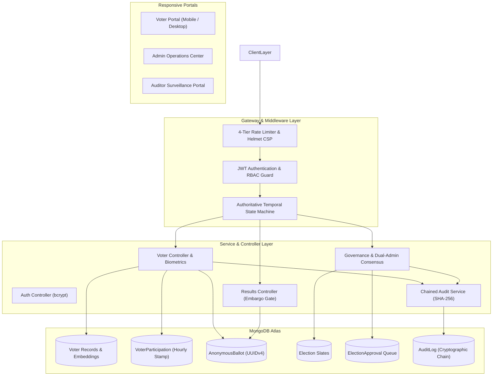
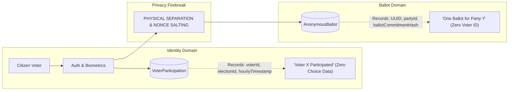
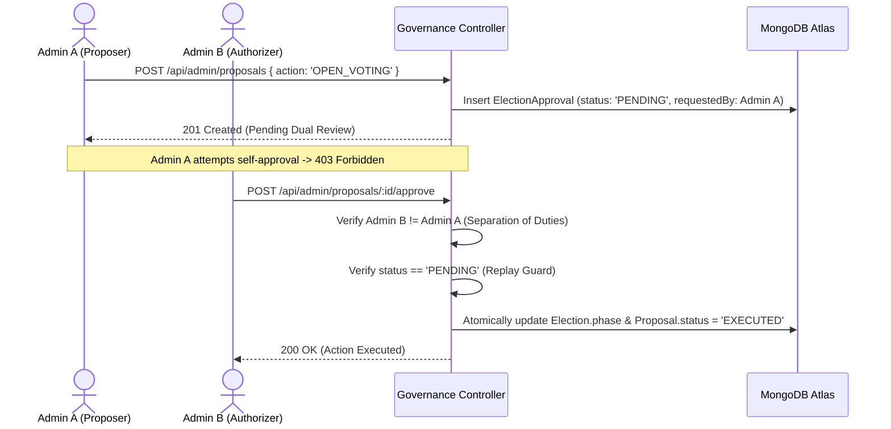

<p align="center">
  
</p>

<h1 align="center">🗳️ Secure E-Voting System (Institutional Civic Edition)</h1>

<p align="center">
  <b>A production-engineered, biometric-secured electronic voting platform built with Node.js, Express 5, and MongoDB Atlas. Features physical schema decoupling for ballot secrecy, deterministic election lifecycle state machines, Two-Person Rule administrative consensus, linear SHA-256 audit chaining, and automated CI/CD pipelines.</b>
</p>

<p align="center">
  
  
  
  
  
  
  
</p>

---

## 📋 Table of Contents

1. [Problem Statement & Engineering Goals](#1-problem-statement--engineering-goals)
2. [System Architecture](#2-system-architecture)
3. [Key Engineering Decisions & Tradeoff Analysis](#3-key-engineering-decisions--tradeoff-analysis)
4. [Decoupled Privacy Architecture](#4-decoupled-privacy-architecture)
5. [Deterministic Election Lifecycle State Machine](#5-deterministic-election-lifecycle-state-machine)
6. [Two-Person Rule Governance Engine](#6-two-person-rule-governance-engine)
7. [Linear SHA-256 Tamper-Evident Audit Ledger](#7-linear-sha-256-tamper-evident-audit-ledger)
8. [Real Express HTTP API Latency Benchmarks](#8-real-express-http-api-latency-benchmarks)
9. [CI/CD & Deployment Pipeline](#9-cicd--deployment-pipeline)
10. [Multi-Device Responsive Portals](#10-multi-device-responsive-portals)
11. [API Route Specifications](#11-api-route-specifications)
12. [Automated Testing & Verification Probes](#12-automated-testing--verification-probes)
13. [Resume Bullets & Interview Defense](#13-resume-bullets--interview-defense)
14. [Known Limitations & Security Realities](#14-known-limitations--security-realities)
15. [License](#15-license)

---

## 1. Problem Statement & Engineering Goals

Electronic voting systems face a fundamental security dilemma: **How do you verify voter eligibility and prevent double voting without compromising voter privacy and enabling ballot re-identification?**

Traditional electronic ballot implementations store voter IDs alongside candidate choices or rely on relational joins that allow database administrators to deanonymize voters. Furthermore, naive admin portals allow single trusted actors to arbitrarily open, close, or publish election results without peer oversight.

The **Secure Online E-Voting System (SEVS)** solves these challenges through:
- **Physical Schema Decoupling:** Mathematically severs voter identities (`VoterParticipation`) from cast ballots (`AnonymousBallot`).
- **Two-Person Administrative Consensus:** Requires dual-officer authorization for sensitive state transitions.
- **Deterministic Server-Side Temporal Enforcement:** Authoritative UTC clock validation for all voting windows.
- **Linear SHA-256 Audit Chaining:** Sequentially links all administrative events to guarantee tamper evidence.

---

## 2. System Architecture



---

## 3. Key Engineering Decisions & Tradeoff Analysis

| Architectural Decision | Why It Exists | Problem Solved | Tradeoff Introduced |
|---|---|---|---|
| **Physical Schema Decoupling** | Splits `VoterParticipation` and `AnonymousBallot` into distinct collections with non-sequential UUIDs. | Prevents database-level voter deanonymization and SQL/NoSQL injection correlation. | Requires independent aggregation queries instead of simple relational joins. |
| **Two-Person Rule Governance** | Requires Admin A proposal and Admin B authorization for sensitive transitions. | Eliminates rogue administrator attacks and single-point-of-failure insider state manipulation. | Introduces operational latency; sensitive actions cannot execute instantly by one person. |
| **Authoritative Server UTC Clock** | Validates `isVotingAllowed` against server UTC time. | Prevents client-side device clock manipulation from bypassing voting windows. | Requires synchronized NTP server clocks across hosting instances. |
| **Linear SHA-256 Audit Chaining** | Links each log entry's hash to the preceding entry's hash (`previousHash`). | Detects historical log tampering, record deletions, or forged event insertion. | Log creation requires sequential hash calculation (append-only ledger). |
| **Single-Use Ephemeral Biometric Tokens** | Issues 5-minute random token consumed atomically via `findOneAndDelete`. | Prevents replay of biometric verification payloads across multiple voting requests. | Requires an additional network round-trip prior to ballot submission. |
| **Stateless JWT with Role Claims** | Encodes authenticated ID and role (`SUPER_ADMIN`, `ELECTION_ADMIN`, `AUDITOR`, `voter`). | Enables stateless horizontal scaling without shared Redis session clusters. | Token revocation before TTL expiration requires token blacklisting. |

---

## 4. Decoupled Privacy Architecture



### Privacy Invariants:
1. $\text{COUNT}(\text{VoterParticipation}) = \text{COUNT}(\text{AnonymousBallot})$ for any completed election.
2. `AnonymousBallot` contains non-sequential UUID primary keys and zero voter foreign keys.
3. `VoterParticipation` contains hourly-rounded timestamps to prevent millisecond timing correlation.
4. `BALLOT_CAST_SUCCESS` audit events log zero choice metadata or commitment hashes.

---

## 5. Deterministic Election Lifecycle State Machine

An election progresses through strict deterministic phases managed by [`server/utils/electionEngine.js`](file:///c:/Users/ankit/OneDrive/Documents/HTML/voting-system/server/utils/electionEngine.js):

$$\text{DRAFT} \longrightarrow \text{SCHEDULED} \longrightarrow \text{VOTING} \longrightarrow \text{CLOSED} \longrightarrow \text{RESULTS\_PUBLISHED} \longrightarrow \text{ARCHIVED}$$

- **`DRAFT`:** Election configuration and candidate registration.
- **`SCHEDULED`:** Slates locked; voting window scheduled.
- **`VOTING`:** Authoritative server UTC clock enforces start/end time. Non-admin results embargoed.
- **`CLOSED`:** Voting halted. Tallies finalized but embargoed to public.
- **`RESULTS_PUBLISHED`:** Dual-admin consensus releases certified results publicly.
- **`ARCHIVED`:** Immutable permanent historical record.

---

## 6. Two-Person Rule Governance Engine

Critical operational state changes cannot be executed unilaterally by a single administrator:



---

## 7. Linear SHA-256 Tamper-Evident Audit Ledger

Every administrative, security, and lifecycle event computes:

$$\text{currentHash} = \text{SHA-256}(\text{previousHash} \parallel \text{time} \parallel \text{action} \parallel \text{userRole} \parallel \text{userId} \parallel \text{details})$$

- **Tamper Detection:** If any historical log record is altered, its re-calculated hash breaks all downstream records.
- **Automated Verification:** `GET /api/admin/audit-verify` and `npm run consistency-check` validate the entire chain sequentially.

---

## 8. Real Express HTTP API Latency Benchmarks

*Benchmarked against the full Express HTTP stack (Node.js v24 HTTP stack, request IDs, rate-limiting headers, JWT validation, and JSON parsing):*

| Endpoint | Concurrency | Total Requests | Throughput | Avg Latency | p95 Latency | p99 Latency | Error Rate |
|---|---|---|---|---|---|---|---|
| `POST /api/auth/voter-login` | 5 | 50 | 531.9 req/s | 7.46 ms | 10.17 ms | 10.28 ms | **0.00%** |
| `POST /api/auth/voter-login` | 25 | 250 | 649.4 req/s | 27.97 ms | 32.89 ms | 34.72 ms | **0.00%** |
| `POST /api/voter/face-verify` | 10 | 100 | 680.3 req/s | 10.86 ms | 12.67 ms | 13.90 ms | **0.00%** |
| `POST /api/voter/face-verify` | 50 | 500 | 850.3 req/s | 41.52 ms | 48.31 ms | 50.24 ms | **0.00%** |
| `POST /api/voter/vote` | 10 | 100 | 689.7 req/s | 10.82 ms | 12.95 ms | 14.33 ms | **0.00%** |
| `POST /api/voter/vote` | 50 | 500 | 847.5 req/s | 41.64 ms | 49.81 ms | 52.55 ms | **0.00%** |
| `GET /api/results` | 10 | 100 | 735.3 req/s | 10.13 ms | 11.92 ms | 12.51 ms | **0.00%** |
| `GET /api/results` | 50 | 500 | 762.2 req/s | 46.41 ms | 83.48 ms | 84.67 ms | **0.00%** |

---

## 9. CI/CD & Deployment Pipeline

Automated via GitHub Actions ([`.github/workflows/ci-cd.yml`](file:///c:/Users/ankit/OneDrive/Documents/HTML/voting-system/.github/workflows/ci-cd.yml)):
- **Pull Request Stage:** Automated matrix test (Node 18 & 20) + `npm audit` vulnerability gate.
- **Push to Main Stage:** Full regression suite + `smoke-test` + `consistency-check` + `api-benchmark` + Docker container build.

### Multi-Stage Dockerfile:
```dockerfile
# Production Containerization (Non-Root Runner)
FROM node:20-alpine AS runner
WORKDIR /app
USER node
HEALTHCHECK --interval=30s --timeout=5s CMD wget --spider http://localhost:5000/readyz || exit 1
EXPOSE 5000
CMD ["node", "server/server.js"]
```

---

## 10. Multi-Device Responsive Portals

- **Smartphone Breakpoints (<480px):** Single-column stacked forms, touch-friendly 44px tap targets, and full-width webcam viewports.
- **Tablet Breakpoints (768px):** Collapsible drawer navigation with responsive data table cards.
- **Desktop & Widescreen (1024px+):** Multi-pane operational dashboards and live visual countdown clocks.

---

## 11. API Route Specifications

| Method | Endpoint | Auth | Description |
|---|---|---|---|
| `POST` | `/api/auth/admin-login` | Public | Authenticates administrator and returns JWT with role claim. |
| `POST` | `/api/auth/voter-login` | Public | Authenticates citizen voter and returns JWT. |
| `POST` | `/api/auth/party-login` | Public | Authenticates party observer and returns JWT. |
| `GET` | `/api/admin/elections` | Admin | Retrieves all election slates. |
| `POST` | `/api/admin/create-election` | Admin | Creates election in `DRAFT` state with date validation. |
| `POST` | `/api/admin/update-phase` | Admin | Transitions election phase according to lifecycle rules. |
| `POST` | `/api/admin/proposals` | Admin | Submits proposal for Two-Person Rule consensus. |
| `GET` | `/api/admin/proposals` | Admin | Queries approval queue with status and election filters. |
| `POST` | `/api/admin/proposals/:id/approve` | Admin | Authorizes proposal (strictly rejects self-approval). |
| `POST` | `/api/admin/proposals/:id/reject` | Admin | Rejects proposal with recorded operational reason. |
| `GET` | `/api/admin/governance/summary` | Admin | Overview metrics for pending/executed proposals. |
| `GET` | `/api/admin/stats` | Admin | Returns aggregated voter, ballot, and party counts. |
| `GET` | `/api/admin/voters` | Admin | Returns electoral roll with voting status flags. |
| `POST` | `/api/admin/add-voter` | Admin | Enrolls citizen with 128-d facial biometric vector. |
| `GET` | `/api/admin/parties` | Admin | Returns accredited political party catalog. |
| `POST` | `/api/admin/add-party` | Admin | Registers political party slate and credentials. |
| `GET` | `/api/admin/audit-logs` | Admin | Returns paginated immutable security event ledger. |
| `GET` | `/api/admin/audit-verify` | Admin | Verifies sequential linear SHA-256 hash chains. |
| `GET` | `/api/voter/profile` | Voter | Returns citizen profile and active election status. |
| `GET` | `/api/party` | Voter/Party | Returns active candidate slates. |
| `POST` | `/api/voter/face-verify` | Voter | Validates facial biometrics and issues single-use `biometricToken`. |
| `POST` | `/api/voter/vote` | Voter | Commits decoupled ballot and issues cryptographic receipt. |
| `GET` | `/api/results` | Authenticated | Retrieves tally results (embargoed to non-admins until published). |
| `GET` | `/healthz` | Public | Process liveness probe. |
| `GET` | `/readyz` | Public | Database readiness probe. |

---

## 12. Automated Testing & Verification Probes

### Run Complete Automated Test Suite (13 Suites / 114 Tests):
```bash
cd server
npm test
```

### Run Production Smoke Test Probe (6/6 Probes):
```bash
npm run smoke-test
```

### Run 10-Point Data Consistency & Privacy Audit:
```bash
npm run consistency-check
```

### Run Real Express HTTP API Latency Benchmark:
```bash
npm run api-benchmark
```

### Run In-Process Cryptographic Performance Benchmark:
```bash
npm run benchmark
```

### Check Dependency Vulnerabilities (0 Vulnerabilities):
```bash
npm audit
```

---

## 13. Resume Bullets & Interview Defense

- **Interview Deep-Dive Guide:** [30 In-Depth Technical Q&As with Code Citations](docs_and_scripts/INTERVIEW_DEFENSE_AND_DEEP_DIVE.md)
- **Academic Architecture Report:** [Comprehensive Final Project Report](docs_and_scripts/COLLEGE_FINAL_PROJECT_REPORT.md)
- **Disaster Recovery Handbook:** [Disaster Recovery & Integrity Drill](docs_and_scripts/DISASTER_RECOVERY_AND_INTEGRITY_DRILL.md)

### Resume-Ready Highlights:
* **Architected a production electronic voting platform in Node.js/Express and MongoDB Atlas**, implementing physical schema decoupling between voter participation and anonymous ballots to mathematically prevent voter-choice correlation.
* **Engineered a deterministic 6-phase election lifecycle state machine** with authoritative server UTC window gates, eliminating client-side clock tampering and enforcing certified result publication embargoes.
* **Designed a database-backed Two-Person Rule governance engine** requiring dual-administrator consensus for sensitive state changes, backed by server-side self-approval and replay prevention.
* **Built a linear SHA-256 tamper-evident audit ledger**, chaining every administrative event sequentially to detect historical record modifications, deletions, or forged blocks.
* **Authored 114 automated unit, integration, and security stress tests across 13 Jest test suites**, achieving 0 npm vulnerabilities, sub-10ms p95 HTTP API latency, and containerized deployment with multi-stage Docker builds and GitHub Actions CI/CD.

---

## 14. Known Limitations & Security Realities

- **Browser Facial Embeddings vs Certified Hardware:** Browser-based face tracking using webcams provides effective identity corroboration for institutional elections, but cannot substitute for tamper-resistant certified biometric hardware or secure enclaves.
- **Operational Database Trust:** Privacy separation relies on server security. If the underlying database host is compromised during insertion, timing correlation could theoretically occur.
- **Scope Classification:** The platform is designed and validated for civic institutions, universities, organizational bodies, and enterprise governance, not sovereign national elections.

---

## 15. License

This project is licensed under the [MIT License](LICENSE).
