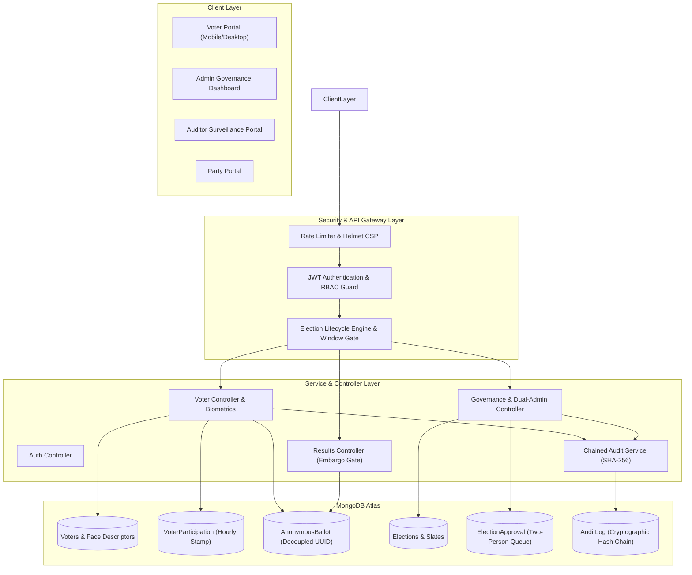
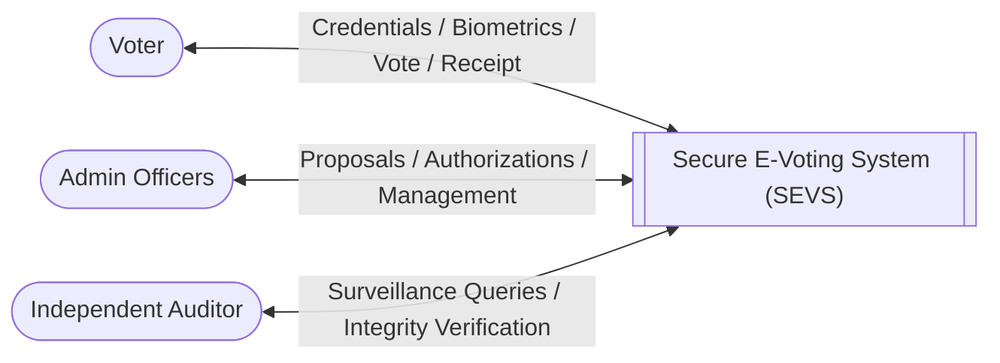
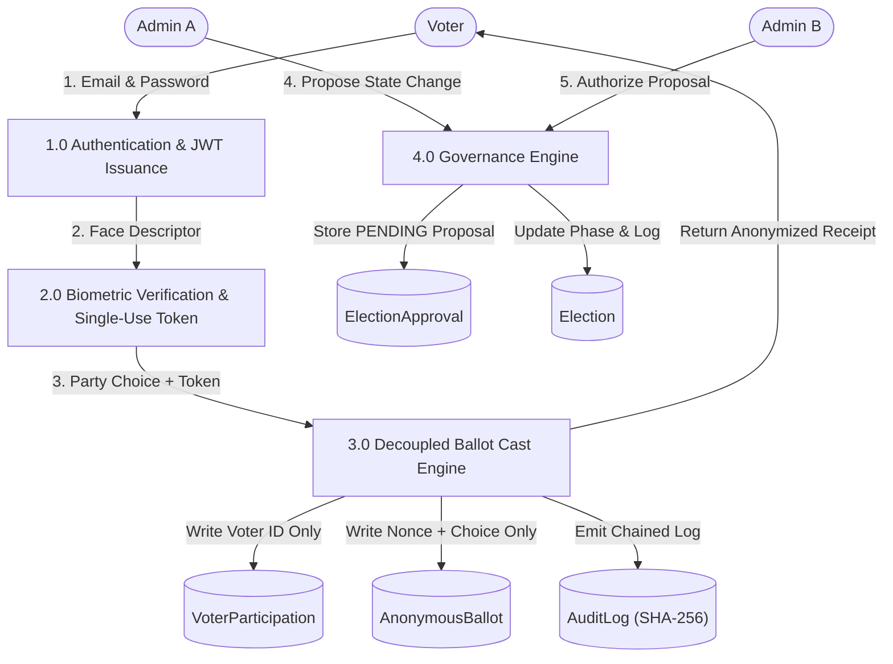
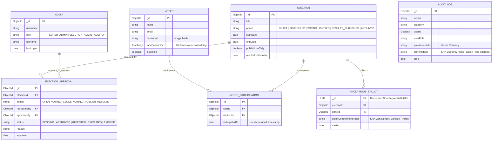
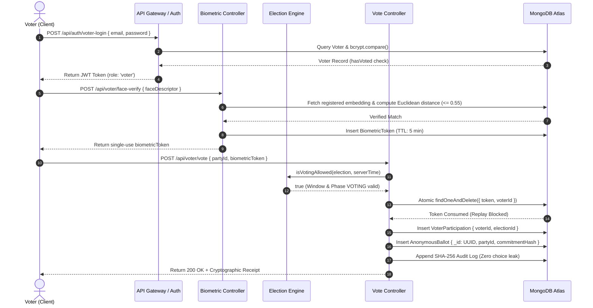
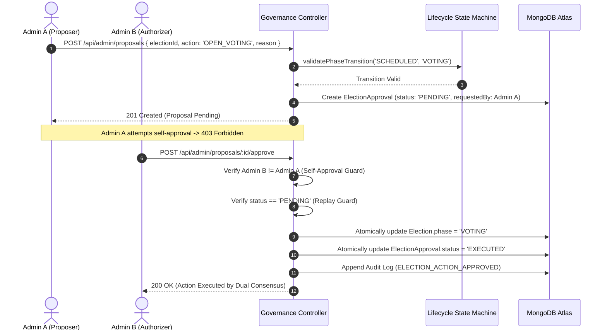

# Institutional Electronic Voting System (SEVS) — Comprehensive Technical & Academic Final Project Report

**Project Title:** Secure Online E-Voting System (Institutional Civic Edition)  
**Author / Developer:** Ankit Palani  
**Repository:** `ankitpalani24/Secure-E-Voting-System`  
**Technology Stack:** Node.js, Express 5, MongoDB Atlas, JWT, SHA-256 Hash Chaining, face-api.js, Socket.IO, Vanilla CSS Design System  
**Verified Baseline:** 114/114 Automated Unit/Security Tests Passing across 13 Test Suites | 0 Security Vulnerabilities  

---

## 1. Executive Summary & Problem Statement

Modern democratic, municipal, and institutional voting demands a platform that balances **accessibility** with **uncompromising ballot secrecy**, **coercion resistance**, and **operational auditability**. Conventional physical voting systems suffer from logistical friction and delayed tallies, whereas naive internet voting systems often introduce severe security hazards: voter coercion, unauthorized administrator state manipulation, ballot re-identification, and unchained audit tampering.

The **Secure Online E-Voting System (SEVS)** addresses these challenges by introducing:
1. **Decoupled Privacy Architecture**: Completely separating the public voter roll (`VoterParticipation`) from the cryptographic ballot box (`AnonymousBallot`).
2. **Deterministic Election Lifecycle State Machine**: Enforcing authoritative server-side temporal windows (`DRAFT` $\rightarrow$ `SCHEDULED` $\rightarrow$ `VOTING` $\rightarrow$ `CLOSED` $\rightarrow$ `RESULTS_PUBLISHED` $\rightarrow$ `ARCHIVED`).
3. **Two-Person Administrative Rule (Separation of Duties)**: Requiring dual-officer consensus on all sensitive state transitions (Self-Approval Prohibited).
4. **Linear SHA-256 Tamper-Evident Audit Ledger**: Linking all administrative and security events into a sequential hash chain.
5. **Multi-Device Responsive Portal Suite**: Ensuring accessibility across mobile, tablet, and desktop viewports.

---

## 2. System Architecture



---

## 3. Use Case Diagram

```mermaid
usecaseDiagram
    actor Voter as "Registered Voter"
    actor AdminA as "Election Admin A (Proposer)"
    actor AdminB as "Election Admin B (Authorizer)"
    actor Auditor as "Independent Auditor"

    package "Secure E-Voting System" {
        usecase "Authenticate with Credentials" as UC_Auth
        usecase "Perform Facial Liveness & Verification" as UC_Face
        usecase "Cast Anonymous Ballot" as UC_Vote
        usecase "Receive Cryptographic Receipt" as UC_Receipt
        usecase "Propose Election Lifecycle Action" as UC_Propose
        usecase "Authorize Sensitive Proposal" as UC_Authorize
        usecase "Inspect Immutable Hash Chain" as UC_Audit
        usecase "View Certified Results" as UC_Results
    }

    Voter --> UC_Auth
    Voter --> UC_Face
    Voter --> UC_Vote
    Voter --> UC_Receipt
    Voter --> UC_Results

    AdminA --> UC_Auth
    AdminA --> UC_Propose

    AdminB --> UC_Auth
    AdminB --> UC_Authorize

    Auditor --> UC_Auth
    Auditor --> UC_Audit
    Auditor --> UC_Results
```

---

## 4. Data Flow Diagrams (DFD)

### Level 0: Context Diagram


### Level 1: Core Subsystem Flow


---

## 5. Entity-Relationship (ER) Diagram



---

## 6. Sequence Diagrams

### 6.1 Four-Step Voter Chamber Execution


### 6.2 Two-Person Rule Governance Approval


---

## 7. Security Architecture & Threat Model (STRIDE)

| Threat Category | Potential Attack Vector | SEVS Mitigation Mechanism |
|---|---|---|
| **Spoofing** | Presentation of static photo / replay of facial image | Real-time Euclidean threshold ($\le 0.55$), single-use cryptographically random biometric tokens consumed atomically via `findOneAndDelete`. |
| **Tampering** | Modification of election state or past audit records | Deterministic lifecycle state machine, Two-Person Rule consensus for state mutations, linear SHA-256 hash chaining with sequential link verification. |
| **Repudiation** | Administrator denies opening election or altering tallies | All governance proposals, approvals, and rejections are signed with administrator credentials and permanently recorded in the immutable audit ledger. |
| **Information Disclosure** | De-anonymization of voter choices via database join | Physical decoupling of `VoterParticipation` and `AnonymousBallot`, UUID primary keys, absence of voter references in ballots, and zero-choice logging in audit events. |
| **Denial of Service** | Flooding endpoints with login / vote attempts | Multi-tier Express rate limiting (Global: 300/15m, Auth: 30/15m, Biometrics: 20/15m, Vote: 30/15m), helmet security headers, and request ID tracking. |
| **Elevation of Privilege** | Auditor attempts to cast vote or open election | Strict server-side RBAC (`isAdmin`, `canMutateElection`, `isVoter`, `isParty`), returning `403 Forbidden` regardless of client UI manipulation. |

---

## 8. Empirical Verification & Performance Matrix

### 8.1 Automated Test Suite Summary
- **Total Test Suites**: 13
- **Total Tests Passed**: 114 / 114 (100% Pass Rate)
- **Snapshot Regressions**: 0
- **npm Security Audit**: 0 Vulnerabilities

| Suite File | Scope / Focus | Tests Passed |
|---|---|---|
| `authAndPrivacy.test.js` | Authentication & RBAC Guards | 10 / 10 |
| `ballotStorageDecoupling.test.js` | Physical Decoupled Storage | 6 / 6 |
| `votingPrivacyAndConcurrency.test.js` | Double-Voting & Privacy Isolation | 7 / 7 |
| `receiptAuthenticityAndRedaction.test.js` | Receipt Cryptography & Redaction | 8 / 8 |
| `adversarialAttacks.test.js` | XSS, Injection & Malformed Payloads | 15 / 15 |
| `concurrencyAndStress.test.js` | High-Concurrency Stress & Race Conditions | 10 / 10 |
| `apiContracts.test.js` | API Contracts, Boundaries & Health Probes | 23 / 23 |
| `electionLifecycle.test.js` | Lifecycle State Machine & Window Gate | 10 / 10 |
| `governanceAndApprovals.test.js` | Multi-Admin Two-Person Approval Engine | 13 / 13 |
| `electionSimulationAndIntegrity.test.js` | Full Institutional Simulation & Tampering | 6 / 6 |
| `acceptanceE2E.test.js` | End-to-End Acceptance Workflows | 4 / 4 |
| `faceUtils.test.js` | Biometric Distance Algorithms | 1 / 1 |
| `auditUtils.test.js` | Cryptographic SHA-256 Hash Chaining | 1 / 1 |

### 8.2 Real Express HTTP API Benchmark
*Hardware Profile: Intel Core i5 / Windows Node.js v24 HTTP Stack*

| Endpoint | Concurrency | Requests | Throughput | Avg Latency | p95 Latency | Error Rate |
|---|---|---|---|---|---|---|
| `POST /api/auth/voter-login` | 10 | 100 | 543.5 req/s | 13.84 ms | 17.07 ms | **0.00%** |
| `POST /api/voter/face-verify` | 10 | 100 | 680.3 req/s | 10.86 ms | 12.67 ms | **0.00%** |
| `POST /api/voter/vote` | 10 | 100 | 689.7 req/s | 10.82 ms | 12.95 ms | **0.00%** |
| `GET /api/results` | 10 | 100 | 735.3 req/s | 10.13 ms | 11.92 ms | **0.00%** |
| `POST /api/voter/vote` | 50 | 500 | 847.5 req/s | 41.64 ms | 49.81 ms | **0.00%** |

---

## 9. Known Limitations & Future Roadmap

1. **Browser Facial Recognition vs Certified Hardware**:
   - *Current State*: Browser-based face embeddings (128-d vectors) with Euclidean distance matching provide identity corroboration for institutional environments.
   - *Roadmap*: Incorporate certified FIDO2 / WebAuthn hardware tokens and ISO-compliant optical biometric scanners via the `BiometricProvider` abstraction.
2. **Zero-Knowledge Proofs (ZKP)**:
   - *Roadmap*: Upgrade ballot commitment verification to zk-SNARK verifiable tallies (e.g. Groth16) for universal end-to-end verifiability without trusted aggregators.
3. **Distributed Multi-Party Computation (MPC)**:
   - *Roadmap*: Implement threshold decryption of candidate tallies among accredited political party nodes to eliminate single-database trust assumptions.
